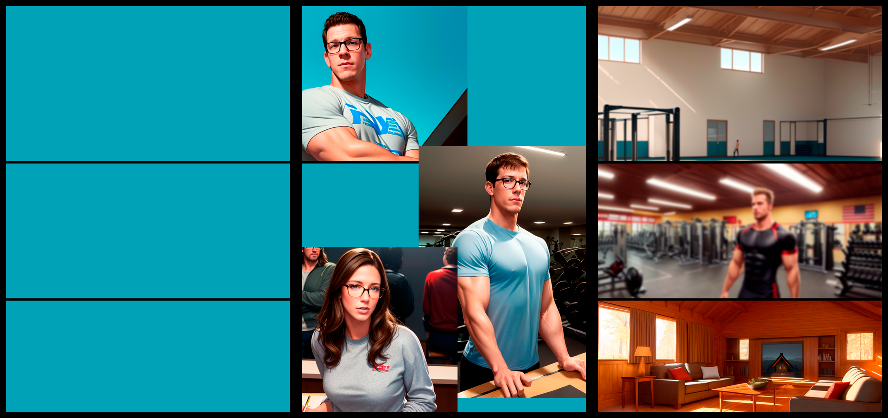

# Process

The main objective of the project was to create a graphic novel using only AI-generated images. Therefore, the initial phase of the project focused on getting familiar with different AI tools and selecting the most suitable one for image generation.

I'm using the Web UI of [Automatic1111](https://github.com/AUTOMATIC1111/stable-diffusion-webui), which I found to be the most intuitive tool for my purposes. The support for extensions also makes it a powerful tool for the creative process.

I started by defining some proofs of concept, namely the checkpoints to use and the construction of prompts. My process is not intended to be the best; it's just my way of working.

Through Collab, I initially trained some models that I ended up not including in my workflow. I sought to find models available on Civitai that would allow me to define an appealing style for my ideas.

This project is based on a merged version of Deliberate and Perfect World. The Deliberate checkpoint serves to minimize the strong Asian and anime-like tendencies that the Perfect World has as its foundation.

During the process, some LORAS were trained with [Kohya's GUI](https://github.com/bmaltais/kohya_ss)  for characters and some specific artistic style, like point of view angles.

The editing tool used to create the panels is Photoshop. The storyline is original, although it may be a little cheesy. ChatGPT is used to correct and refine the grammar since English is not your native language.
I also jailbroke ChatGPT, so I can write more nsfw content.

**Keep in mind, that I've generated over 19,324 pieces of content for this project up until the day of creating this document. Many times, I manage to achieve what I want through trial and error, as well as bulk generation. I also pray to the RNG Gods**

## Automatic1111 Web UI 

mainly, after figured the checkpoint used, settle with my base configuration.


**Positive prompts for character creation**
```text copy
[type of shot] of [ character and description of phisical attributes] ,  wearing [ description of clothing] , [ description of action, and facial expression] ,  [detailed skin, highly detailed texture,  perfect detailed face,  correct anatomy, perfect detailed eyes, perfect perspective],  digital art, matte, cinematic, volumetric light,  shadows,   sharp focus, illustration,    masterpiece,  8k, art by Nick Alm  and roberto ferri and ilya kuvshinov
```
**Negative prompts**
```text copy
wires, ear rings, dirty face (deformed iris, deformed pupils, bad eyes, semi-realistic:1.4) (bad-image-v2-39000, bad_prompt_version2, bad-hands-5, EasyNegative, NG_DeepNegative_V1_4T, bad-artist-anime:0.7),(worst quality, low quality:1.3), (greyscale, monochrome:1.1), nose, cropped, lowres, text, jpeg artifacts, signature, watermark, username, blurry, artist name, trademark, watermark, title, (tan, muscular, loli, petite, child, infant, toddlers, chibi, sd character:1.1), multiple view, Reference sheet, long neck
```

### generated Examples

I used this config and prompts to generate the images below:


When I find a image that I like, usually send it to IMG2IMG to iterate over with loopback and see if I can get a better one. I also use the image as a reference only in [ControlNet](https://github.com/lllyasviel/ControlNet-v1-1-nightly) and iterate a little more. Sometimes I get better results, and especially images batches with a certain level of coherence.

I also use [Dynamics prompts](https://github.com/adieyal/sd-dynamic-prompts) extension to create variations, in this example I use it to create camera variations.


Combine Dynamics prompts with ControlNet (reference only) can also be of great help in getting consistency. But is important to work with weights so you can have different results that will respect the new prompts. In the examples thre result are very similiar, which in some cases can be great to achieve the ideal image.


Other extensions I usually use are:

[Regional Prompter](https://github.com/hako-mikan/sd-webui-regional-prompter) - mainly to achieve images with multiple characters.


## Photoshop integration

### Mockup Phase

By having the necessary images to create the narrative. I use photoshop to compose the panels. The first part is to mock up the panels, I have this poorly drawn attempts so I can have an idea of how to arrange the panels. Don't mind the texts, is gibberish.


I also do drawing to create some characters, in this case a possible "wicked thoughts" demon. Then work with it in controlNet and from try and error, I usually have decent images.


### Creation Phase

Define a layout, for this examples I'm choosing a very simple panel division. The colored areas help me define the bounderies of each subsection. it is also important to define the masks used.

I place the desired images that will be the focus point of each panel, and then choose the backgrounds. The backgrounds I usually apply some blur properties, the main reason is to focus on the character and also  because the images generated have some flaws, so by applying the blur, those flaws are minimized in the composition.



In the next step, I use the mask tools to isolate the characters and then if needed, rearrange them. With the  composition made, I place the speech bubbles, and write the texts.
I use the bubbles also as a tool to minimaze flaws, as you can see, I hide hands most of the time, and the bubbles help me with that.  (Not in this particular case)


